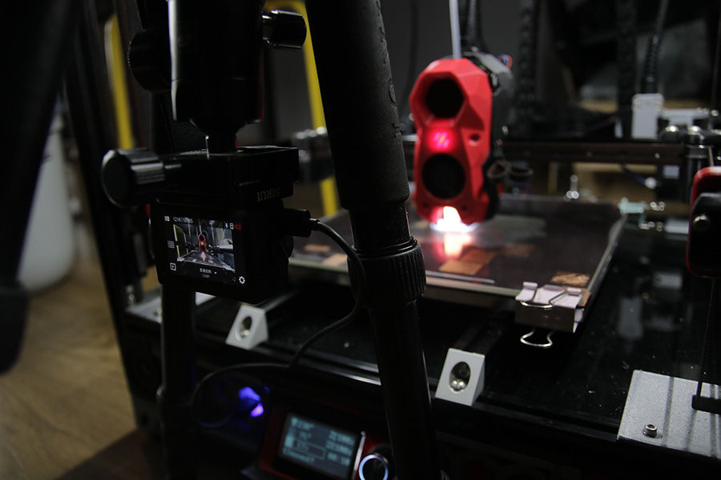

<!--
 * @Author: github @jdiaan, bilibili @i典典典典 UID=24334629, jdiaan@163.com
 * @Date: 2023-09-06 14:48:39
 * @LastEditors: github @jdiaan, bilibili @i典典典典 UID=24334629, jdiaan@163.com
 * @LastEditTime: 2023-09-06 22:16:13
 * @FilePath: \yi_4kplus_for_klipper\README.md
 * @Description: 说明文件
 * jdiaan@163.com
 * Copyright (c) 2023 by github @jdiaan, bilibili @i典典典典 UID=24334629, jdiaan@163.com, All Rights Reserved.
-->
# yi_4kplus_for_klipper
这是包含了小蚁4K+运动相机API以及在3d打印Klipper固件中Gcode调用相机功能的项目

*这是我的第一个上传的项目，目前还在学习阶段，在使用上或各种地方有各种问题请提出，感谢！* 😘😘😘

## 简要说明：

### 为何：
小蚁4K+运动相机是很久很久以前我买的了，这么多年过去了已经是吃灰的状态了。现在，刚好需要给3d打印机一个比较好的记录相机，为何不拿出来重新利用呢？经过几天研究发现这相机其实可以实现很多自己的控制功能，好用！当实现功能后，我发现其实这个就是厂商对应手机APP无线控制相机的方法吧！那么比如说佳能相机，它是否也有可以自己实现类似操作的方法？那么有没有大哥指一条明路？😊

### 实现：
* Python操作小蚁4K+的实现：
  * 感谢以下参考🎉🎉🎉
    * 使用[irungentoo/Xiaomi_Yi_4k_Camera/4k+/wifi](https://github.com/irungentoo/Xiaomi_Yi_4k_Camera/tree/master/4k%2B/wifi)，使相机成功连上网络
    * 使用[irungentoo/Xiaomi_Yi_4k_Camera/telnet](https://github.com/irungentoo/Xiaomi_Yi_4k_Camera/tree/master/telnet)，使相机成功远程连接
    * 参考[ffonord/yi4kplus-video-export](https://github.com/ffonord/yi4kplus-video-export.git)，学习了相机可以打开FTP服务的可能性
    * 参考[irungentoo/Xiaomi_Yi_4k_Camera/camera_controller](https://github.com/irungentoo/Xiaomi_Yi_4k_Camera/tree/master/camera_controller)，学习了控制相机的可能性
    * 因为小蚁4k+使用了安霸芯片因此在网上找到了，类似芯片的[API](https://www.rigacci.org/wiki/doku.php/doc/appunti/hardware/sjcam-8pro-ambarella-wifi-api)，可行!
    > **综上原理，可以实现python对小蚁4k+相机进行控制！**
  * 简易流程：  
    1. 前提：相机需要在添加打开Wifi和Telnet的文件夹和文件来实现这两个功能
    2. 相机成功连接上路由
    3. 脚本TCP连接相机并发送连接的命令
    4. 控制相机修改拍摄设置、更改拍摄模式、拍照、录像等等操作，并会接收响应操作的响应数据
    5. 通过Telnet打开相机上的FTP服务
    6. 通过接收的响应数据获取到视频或图片的文件名，并通过FTP下载到本地文件夹
    7. 本地其它操作✌️
* Klipper中G-Code操作Python代码的实现（由Klipper插件实现）：
  * Klipp关于插件说明的在[代码总览](https://www.klipper3d.org/zh/Code_Overview.html)
  * 由于我太菜的原因没有看懂👆，所以看了官方其它的插件代码，才悟出了一些些道理。因此没有感谢对象，感谢一下我自己。😘
  > 注：你可以使用官方的API服务器来获取信息，可以去看一下[API服务器](https://www.klipper3d.org/zh/API_Server.html)。如果你使用了Moonraker服务，那我更加推荐你去使用他们的API服务器！有[HTTP接口](https://moonraker.readthedocs.io/en/latest/web_api/)，操作非常简单快捷。本库没有加入实现HTTP API的方法，但会在[下方](#如何使用moonraker的说明)写如何操作的说明。
  * 简易流程（[详细](/docs/klipper插件.md)）：  
    1. 将脚本文件（可以是包也可以是单文件）放到你安装的klipper软件文件夹底下，具体路径为：{你的klipper软件文件夹}/klippy/extras/底下
    2. 文件中有专门的使klipper识别的方法和添加G-Code的方法
    3. 在Klipper启动时会读取里面的插件脚本，并加载进环境中
    4. 就能用你添加的G-Code调用脚本啦✌️

### 问题：
* 小蚁4K+：  
  - [ ] 添加使用说明文档
  - [ ] 已经好多年前的相机了，现在貌似挺难买的，价格还不划算😎👉👓🥹
  - [ ] 无法实现上电开机！需要加个外置装置？需要修改电路？有没有大哥搞一个？😍
  - [ ] RTSP服务使用的是手机APP连接相机的那个流服务，不是直播那个。我不晓得怎么更改这个流服务的设置，应该有方法吧😢
* Klipper插件：
  - [ ] 正常调用没问题，但是放在打印机结束代码中调用就出现了无法下载的问题
  - [ ] 添加更改拍摄参数的代码
  - [ ] 整理代码
  - [ ] 虽然在小蚁API中写了几乎有的指令，但是在插件中只是用没几个，因为我自己已经够用了。这么老的设备除我之外应该没啥人使用了，所以没写

### 文件：
* [yi_46_plus](/yi_4k_plus/)    ：klipper插件
* [yi_4k_plus.cfg](/yi_4K_plus.cfg)    ：klipper配置文件
* [Wi-Fi.DEBUG](/这里面的文件放到小蚁4k+的储存卡里好吗)    ：放入小蚁4K+ SD卡中启动Wifi的脚本，需要修改代码才能使用
* [console_enable.script](/这里面的文件放到小蚁4k+的储存卡里好吗/console_enable.script)    ：放入小蚁4K+ SD卡中启动Telnet的脚本，不需要修改代码

## 注意事项：
1. 长时间使用时可以拿出小蚁4k+的电池，直接用type-c口连接5V电源，以此来减少发热对电池的影响

## 如何安装：
1. 在上位机python中安装第三方库
   * ~~requests库：`pip install requests`（使用monraker的HTTP API才需要安装，本插件暂时不需要）~~
   * exifread库：`pip install ExifRead`用来获取图片中的Exif信息
   * Klipper中使用了python虚拟环境，python应该为
2. 需要安装FFmpeg，但是一般你已经安装完其它插件的情况，上位机应该已经安装完成了 **（如果你需要图片合成视频的话，否则不需要）**
   * windows：下载地址 https://www.gyan.dev/ffmpeg/builds/ffmpeg-git-essentials.7z
     1. 解压
     2. 只需要bin文件夹中的ffmpeg.exe就行
   * linux：你自己去[官网](https://ffmpeg.org/download.html)找，看好你哦
3. 将[console_enable.script](/这里面的文件放到小蚁4k+的储存卡里好吗/console_enable.script)文件放入相机用的SD卡根目录
4. 将[Wi-Fi.DEBUG](/这里面的文件放到小蚁4k+的储存卡里好吗)整个文件夹放入相机用的SD卡根目录
5. 修改[Wi-Fi.DEBUG/start.sh](/这里面的文件放到小蚁4k+的储存卡里好吗/Wi-Fi.DEBUG/start.sh)这个文件内的代码  
   * 将{Wifi名}修改为你的无线名称
   * 将{Wifi密码}修改为你的无线密码
   * 将{静态IP地址}修改为你设置的ip地址
    > 原代码：`/usr/local/share/network/start.sh WIFI_MODE=sta STA_SSID={Wifi名} STA_PASSWD={Wifi密码} STA_FREQ=1 STA_NAME=yi_cam_1 STA_SCAN=1 CHIP_TYPE=43340 WIFI_MAC=58:70:C6:AA:AA:AA STA_IP={静态IP地址}`  
    > 我的wifi名是：`密码是啥不告诉你`  
    > 我的wifi密码是：`shabugaosuni`  
    > 我设置一个没有使用的IP：`192.168.1.10`  
    > 所以最终的代码为：`/usr/local/share/network/start.sh WIFI_MODE=sta STA_SSID=密码是啥不告诉你 STA_PASSWD=shabugaosuni STA_FREQ=1 STA_NAME=yi_cam_1 STA_SCAN=1 CHIP_TYPE=43340 WIFI_MAC=58:70:C6:AA:AA:AA STA_IP=192.168.1.10`  
    > 聪明的你学会了吗？  
6. 将[yi_46_plus](/yi_4k_plus/)文件放到你安装的klipper路径下的/klippy/extras/yi_4k_plus/底下
7. 将[yi_4k_plus.cfg](/yi_4K_plus.cfg)文件放到/home/orangepi/printer_data/config底下，应该都是一样的吧
8. 你可以修改[yi_4k_plus.cfg](/yi_4K_plus.cfg)中的配置，**其实改不改都无所谓，因为我还没写相关的代码呢**
    >* ip: 192.168.199.16                         # *IP地址
    >* output_path: ~/timelapse/                  # *最终合成文件地址
    >* frame_path: /tmp/yi4kplus                  # 缓存的位置
    >* ffmpeg_binary_path: /usr/bin/ffmpeg        # ffmpeg的位置
    >* =======================================
    >* port: 7878                                 # 端口，不修改就行
    >* resolution: 12MP (4000x3000 4:3) fov:w     # 照片分辨率
    >* shutter: auto                              # 快门速度
    >* meter: center                              # 测光模式
    >* wb: 5500k                                  # 色温
    >* color: flat                                # 色彩模式
    >* iso_min: 100                               # 最小感光度
    >* iso: 400                                   # 感光度
    >* sharpness: medium                          # 锐度
    >* ev: 0                                      # 曝光补偿
    >* stamp: off                                 # 时间戳
    >* quick_view: off                            # 
    >* file_type: jpg                             # 保存文件类型
9.  重启整个上位机
10. enjoy🎉

## 如何使用：
1. 你可以直接试试这些G-Code打在控制台来操作小蚁4k+的相机了 **（请不要使用开头带_的命令，除非你知道你在干什么）**  
   * `YI_GET_PHOTO_OPTIONS`
   * `YI_CONNECT_CAMERA`
   * `YI_TAKE_PHOTO`
   * `YI_DOWNOLD`
   * `YI_RENDER_VIDEO`
   * `YI_DISCONNECT_CAMERA`  
你可以点击？-> 输入 YI 来查询命令列表啦

2. 可以将G-Code放在你想放的位置

## 其它：

### 单独的API使用测试文件（请自行修改必要的代码）：
[camera_api_test.py](/test/camera_api_test.py)：里面有不详细的方法使用介绍

### Klipper插件教程：
很简单就一句话概括！请看[klipper插件.md](/docs/klipper插件.md) **(👈这是一句话)**

### 如何使用Moonraker API：
请看文档[Moonraker_API说明.md](/docs/Moonraker_API说明.md)

## 感谢：
感谢资料获取的库和网站  
Xiaomi_Yi_4k_Camera -> https://github.com/irungentoo/Xiaomi_Yi_4k_Camera.git  
yi4kplus-video-export -> https://github.com/ffonord/yi4kplus-video-export.git  
rigacci.org -> https://www.rigacci.org/wiki/doku.php/doc/appunti/hardware/sjcam-8pro-ambarella-wifi-api  