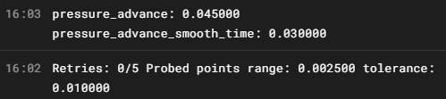

<!--
 * @Author: github @jdiaan, bilibili @i典典典典 UID=24334629, jdiaan@163.com
 * @Date: 2023-09-06 17:26:52
 * @LastEditors: github @jdiaan, bilibili @i典典典典 UID=24334629, jdiaan@163.com
 * @LastEditTime: 2023-09-06 20:36:20
 * @FilePath: \yi_4kplus_for_klipper\docs\klipper插件.md
 * @Description: klipper插件说明
 * jdiaan@163.com
 * Copyright (c) 2023 by github @jdiaan, bilibili @i典典典典 UID=24334629, All Rights Reserved.
-->
# 关于Klipper插件的简单教学

## 说明（Q&A）：

### 官方中文说明：
[官方说明](https://www.klipper3d.org/zh/Code_Overview.html)

---

### 插件文件位置：
`{你的klipper软件文件夹}/klipper/extras/`

---

### 使用代码语言：
内置的都是由python3实现的，但是你可以用python调用其它语言写的脚本

### 如何被识别为Klipper插件脚本：
* 既可以是包又可以是单脚本文件，包的话将入口方法写在`__init__.py`文件中
* Klipper中模块的名称是你添加入口方法的那个函数的文件名称（也许是你返回类的文件名称）
* 一个文件时一个模块
* 一个文件中可以包含多个调用G-Code
* 添加一个函数并返回你的类或其它方法，klipper中的[说明中的第一条](https://www.klipper3d.org/zh/Code_Overview.html#_6)。当你添加后就会被识别为Klipper中的一个模块（不是Klipper中的那些可以执行的方法），你可以在配置文件中配置属于你自己的参数。  
* 例如：  
  * 在本库文件[__init__.py](/yi_4k_plus/__init__.py)中就有添加，因此当你把包放在extras文件夹下时，会被klipper识别为插件
#### 有两种识别的函数
* 假设这是我写的插件`MyPlugin.py`  
    *config*参数为Klipper传递的object,可以在这获得当前各种关于打印机的方法或者属性
    ```python
    class MyClass:
        def __init__(self, config):
            pass
    ```
* 第一种，不需要写入名称的入口函数
    ```python
    def load_config(config):
        return MyClass(config)
    ```
* 第二种，需要添加名称的入口函数
    ```python
    def load_config_prefix(config):
        return MyClass(config)
    ```
* 区别在于
  * 第一种，Klipper中的配置： 
    ```
    [MyPlugin]
    # 下面都是配置的参数
    ```
  * 第二种：
    ```
    [MyPlugin XXXX]
    # 下面都是配置的参数
    ```
    python脚本中，可以通过`config.get_name().split()[-1]`获取到你所添加的名称
> 🌟当在Klipper中添加相关配置，就会执行你返回类中初始函数`__init__`，而且在Klipper启动之后就会调用。因此你可以将自己需要的初始代码都放在这

---

### 如何读取用户配置的参数：
假设我的配置文件，如下
```
[MyPlugin]
a: 123456
b: asdasd
c: 0.123456
```
在你的`__init__`函数中添加一些代码，如下：
```python
class MyClass:
    def __init__(self, config):
        ...

        # 以int的方式读取参数a的值，用户可选的参数，不配置就获得`default`的值
        self.a = config.getint("a", default=456)
        # 以str的方式读取参数b的值，没有default则用户必须配置这个参数
        self.b = config.get("b")
        # 以float的方式读取参数b的值，没有default则用户必须配置这个参数
        self.b = config.getfloat("c")

        ...
```
>* 🌟如果没有添加`default`的话，Klipper会让用户强制输入参数b和它的值。添加`default`后用户可以输入也可以不填，不填的话就会曲的`default`的值  
>* 🌟注意不同类型有不同的输入参数！！！请参考官方库的代码文件！！！  
>* 🌟还有其它读取参数的方法在官方库[configfile.py](https://github.com/Klipper3d/klipper/blob/5f990f93d533247d3a675e8c423280f4333ad8ce/klippy/configfile.py)中有，例如
>   * get
>   * getint
>   * getfloat
>   * getboolean
>   * getchoice
>   * getlists
>   * getlist
>   * getintlist
>   * getfloatlist
>   * getsection

---

### 如何告诉用户，参数配置的有问题：
可以在你的`__init__`函数中添加一些代码，如下
```python
class MyClass:
    def __init__(self, config):
        ...

        # 获取b参数用户输入的值
        b = config.get("b")
        # 如果我要求必须b这个参数应该填入IP地址而不是其他的字符串
        if b is not ip地址:
            raise config.error("参数b必须为ip地址！！！")
        # 或者
        # printer = config.get_printer()
        # raise printer.config_error("my error")

        ...
```

---

### 如何获取Klipp运行时类的引用（应该是指针吧）：
可以在你的`__init__`函数中添加一些代码。具体能获取到哪些，都有什么作用。小伙子就靠你自己了，我也不知道（知道了请告诉我，谢谢您😘）。如下：
```python
class MyClass:
    def __init__(self, config):
        ...

        # 比如我要获得`printer`类的引用，这是最主要的，其他的类都通过这个主类来获取
        self.printer = config.get_printer()

        # 获得其他的类，比如`gcode`,可以在gcod中添加自己的G-Code...
        gcode = self.printer.lookup_object("gcode")

        ...

```

---

### 如何获取Klipp运行时其他模块的引用（应该是指针吧）：
可以在你的`__init__`函数中添加一些代码，如下：
```python
class MyClass:
    def __init__(self, config):
        ...

        # 比如获取print_stats模块的实例
        print_stats_object = self.printer.load_object(config, "print_stats")

        # 我可以通过获取这个模块的变量`filename`获得正在打印的文件名
        now_print_file_name = print_stats_object.filename

        # 其它的靠你自己去看代码了...

        ...

```

---

### 如何在Klipper中输出你想说的：
在哪都行，如下：
```python
import logging

class MyClass:
    def __init__(self, config):
        ...

        self.printer = config.get_printer()
        self.gcode = self.printer.lookup_object("gcode")

        ...
    def test(self):
        ...

        # 报错
        raise self.printer.config_error("报错")
        # 在控制台输出
        self.gcode.respond_info("在控制台输出")
        # 其它的就用logging模块，你懂的。貌似默认是输出info级别的，你可以储存自己的日志文件
        logging.info("info")

        ...

```
在控制台显示信息


---

### 如何添加我的G-Code：
可以在你的`__init__`函数中添加一些代码，我构造一个print函数出来，如下：
```python
class MyClass:
    def __init__(self, config):
        ...

        self.printer = config.get_printer()
        self.gcode = self.printer.lookup_object("gcode")

        # 第一种
        self.gcode.register_command(
            "TEST_PRINT",                   # G-Code的取名
            self.cmd_TEST_PRINT,            # 调用哪个函数
            desc=self.cmd_TEST_PRINT_help,  # 说明
        )

        # 第二种我不太认识，在官方文档里抄一个
        self.gcode.register_mux_command(
            "SET_FAN_SPEED", "FAN",
            self.fan_name,
            self.cmd_SET_FAN_SPEED,
            desc=self.cmd_SET_FAN_SPEED_help
        )

        ...
    
    cmd_TEST_PRINT_help = "print出你想说的话"
    def cmd_TEST_PRINT(self, gcmd):
        # raise gcmd.error("报错")
        text = gcmd.get("text", "没有想说的话")
        gcmd.respond_info(text)

    cmd_SET_FAN_SPEED_help = "Sets the speed of a fan"
    def cmd_SET_FAN_SPEED(self, gcmd):
        speed = gcmd.get_float('SPEED', 0.)
        self.fan.set_speed_from_command(speed)

```
在Klipper中调用你写的脚本：
```
TEST_PRINT text=我不想说话
```

---

### 我突然不记得还要补充啥了，就不补充了😢

## 最后：
好了我已经把我目前知道的教给你了，你现在就可以试试造个原子弹出来了。